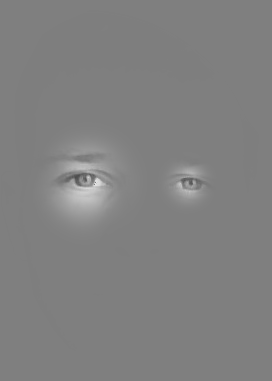
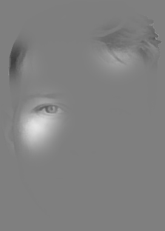
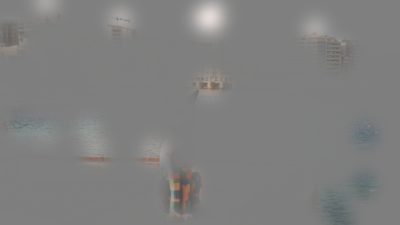

# bubblemask

[](https://zenodo.org/badge/latestdoi/562151332)

Python modules for applying the Gaussian 'Bubbles' mask to image stimuli, as described by [Gosselin and Schyns (2001)](https://doi.org/10.1016/S0042-6989(01)00097-9). This approach applies a mask to an images, with a number of Gaussian 'bubblemask' providing windows to the actual pixel values. The method is useful for probing the functional impact of information at different locations in an image (e.g., informativeness of different face regions for emotion recognition). The method can also be applied to examine the size of such functional regions (varying sigma of the Gaussian bubbles), or features like colour (applying the technique to RGB separately) or the spatial frequency of relevant information (applying to specific frequency bandwidths).

The `bubblemask` module implements the Gaussian bubbles method, applying a mask with any number of bubbles, optionally with per-bubble sigma parameters, to a given image. The 2-D bubbles are calculated using the outer product of 1-D Gaussian densities.

## Basic Usage

All functions are provided in module `bubblemask.py`

```python
import bubblemask
import os.path as op
from PIL import Image
```

`bubbles_mask()` is the main function, which generates and applies a mask with `len(sigma)` bubbles to a PIL image. By default, these will be positioned randomly. Here, we add 5 bubbles, of various sigmas, to an image of a face on grey background.

```python
face = Image.open(op.join('img', 'face.png'))
face1, mask, mu_x, mu_y, sigma = bubblemask.bubbles_mask(im=face, sigma=[17, 19, 20.84, 25, 30], bg=127)

face.show(); face1.show()
```


The function also outputs the mask as a `numpy` array.

```python
import matplotlib.pyplot as plt
plt.imshow(mask)
plt.colorbar()
```


The function also outputs the x and y locations of the centres of the Gaussian bubbles (`mu_x` and `mu_y`) and the corresponding `sigma` values (equal to provided `sigma` argument).

```python
print(mu_x)
```

```
[151.47868249  30.62953573  67.66242641 248.33505263 189.49367428]
```

```python
print(mu_y)
```

```
[ 27.5013962  231.37643177 292.48458643 215.76040095  87.04159864]
```

```python
print(sigma)
```

```
[17, 19, 20.84, 25, 30]
```

## Specifying Bubble Locations

By default, `bubbles_mask()` will position bubbles randomly in the image. The exact desired locations of bubbles can be specified via the `mu_x` and `mu_y` arguments. Here I specify two bubbles to be centred on eyes, with different sigma values, of 20 and 10. Note that `mu_x` and `mu_y` can be floats.

```python
face2 = bubblemask.bubbles_mask(
    im=face, mu_x=[85, 186.7], mu_y=[182.5, 182.5], sigma=[20, 10], bg=127
)[0]

face2.show()
```



## Using a Convolution-Based Method

Previous implementations I've seen have used a convolution-based approach, where bubble locations are convolved with a Gaussian kernel. This is also available, with the `build_conv_mask()` and `bubbles_conv_mask()` functions. Key differences are that:
* Sigma values must be identical for all bubbles, as one kernel is applied globally (could alternatively average over multiple per-sigma convolutions)
* Locations of `x` and `y` must be integers (rounded if floats) so that bubble precision is limited by resolution of the image

Here is a comparison of the methods:

```python
mu_x = [85, 21, 47, 254, 193]
mu_y = [186, 102, 219, 63, 80]
sigma = [20, 20, 20, 20, 20]

# method using outer products of Gaussian densities
face3a, mask3a, _, _, _ = bubblemask.bubbles_mask(im=face, mu_x=mu_x, mu_y=mu_y, sigma=sigma, bg=127)

# method using convolution with Gaussian kernel
face3b, mask3b, _, _, _ = bubblemask.bubbles_conv_mask(im=face, mu_x=mu_x, mu_y=mu_y, sigma=sigma, bg=127)

# compare faces
face3a.show(); face3b.show()
```




```python
# compare masks
plt.imshow(mask3a); plt.colorbar()
plt.imshow(mask3b); plt.colorbar()
```


There are only small differences in the approaches, owing to (I think?) floating point precision:

```python
plt.imshow(mask3a-mask3b)
plt.colorbar()
```


This means that with reasonable rounding of the masks, the approaches would be functionally equivalent, except that the method using the outer product of densities is (i) more precise in specifying mu, and (ii) supports bubbles of different sizes.

## Avoiding Uninformative Locations

It is often more efficient to avoid adding bubbles to regions that you know have no informative information, such as the background. `bubbles_mask_nonzero()` uses a binary dilation method ([`skimage.morphology.binary_dilation`](https://scikit-image.org/docs/stable/api/skimage.morphology.html#skimage.morphology.binary_dilation)) to exclude regions of the background which are sufficiently distant as to be uninformative.

Specifically, the centres of each bubble (`mu_x`, `mu_y`) will be within `max_sigma_from_nonzero` multiples of that bubble's `sigma` value from a non-background pixel. Background pixels are identified as `im <= bg`.

The usage is similar to `bubbles_mask()`, but with additional argument `max_sigma_from_nonzero`. Here, we use 4 bubbles and specify that the centre of each bubble should be no more than 2 standard deviations away from the non-background pixels of the letter *a*.

```python
a = Image.open(op.join('img', 'a.png'))

a1 = bubblemask.bubbles_mask_nonzero(
    im=a, sigma=[10,10,10,10], bg=127, max_sigma_from_nonzero=2
)[0]

a.show(); a1.show()
```


Here is a snippet demonstrating that `bubbles_mask_nonzero()` only selects bubble locations whose centres are <=`max_sigma_from_nonzero` standard deviations of the non-background pixels. This shows 1000 bubbles (in blue) superimposed on the letter *a* (in red), with bubbles' centres at a maximum distance of 1 standard deviations from the character.

```python
a2, mask, mu_x, mu_y, sigma = bubblemask.bubbles_mask_nonzero(
    im=a, sigma=np.repeat(3, repeats=1000), bg=127, max_sigma_from_nonzero=1
)

a_arr = np.asarray(a).copy()
a_arr[a_arr==127] = 0
a_arr[:,:,1] = 0
a_arr[:,:,2] = mask * 255
Image.fromarray(a_arr).show()
```


Note: you can also specify a reference image, `ref_im`, from which the background pixels in `im` should be identified. This is useful in cases where `im` has already been altered (e.g., phase-randomised).

## Naturalistic Images

Typical stimuli using the Bubbles technique use artificial stimuli on grey backgrounds, but this method can also be applied to more naturalistic, colour stimuli, with the background defined by the `bg` argument.

```python
cat = Image.open(op.join('img', 'cat.jpg'))

cat1 = bubblemask.bubbles_mask(im=cat, sigma=np.repeat(10, 20), bg=127)[0]
cat2 = bubblemask.bubbles_mask(im=cat, sigma=np.repeat(10, 20), bg=0)[0]
cat3 = bubblemask.bubbles_mask(im=cat, sigma=np.repeat(10, 20), bg=[127, 0, 55])[0]

cat.show(); cat1.show(); cat2.show(); cat3.show()
```





## Bubble Merging Method

An advantage of this approach is that bubbles of different sizes can be merged. By default, this implementation averages the bubbles and scales the result to within [0, 1]. An alternative may be to take the sum and apply a threshold of the pre-sum maximum across the bubbles. Similarly, the method scales bubbles by default, so that bubbles of different sigma have equal maxima in their densities, where an alternative would be to leave the bubbles unscaled.

Here is a visualisation of the possible options in mask construction, using `sum_merge` and `scale` arguments, which can be passed to `bubble_mask()`:

```python
# same bubble parameters for all masks
mu_y = [20, 30, 70]
mu_x = [20, 30, 90]
sigma = [5, 10, 7.5]
sh = (100, 100)

# plot all mask options (the first is the default)
masks = [bubblemask.build_mask(mu_y, mu_x, sigma, sh, scale=True, sum_merge=False),
         bubblemask.build_mask(mu_y, mu_x, sigma, sh, scale=True, sum_merge=True),
         bubblemask.build_mask(mu_y, mu_x, sigma, sh, scale=False, sum_merge=False),
         bubblemask.build_mask(mu_y, mu_x, sigma, sh, scale=False, sum_merge=True)]

for i in range(4):
    plt.imshow(masks[i])
    plt.colorbar()
```


## Command Line Interface

The `bubbles_mask()` function can be accessed from the command line. This requires an `input` argument for a file path to the original image, and an `--output` argument, to write the result to file.

```
python bubblemask.py --help
```

```
usage: bubblemask.py [-h] -i INPUT -o OUTPUT -s SIGMA [SIGMA ...] [-x MU_X [MU_X ...]]
                     [-y MU_Y [MU_Y ...]] [-b BACKGROUND [BACKGROUND ...]] [--unscaled]
                     [--summerge] [--seed SEED]

options:
  -h, --help            show this help message and exit
  -i INPUT, --input INPUT
                        the file path for the input image
  -o OUTPUT, --output OUTPUT
                        the path of the desired output file
  -s SIGMA [SIGMA ...], --sigma SIGMA [SIGMA ...]
                        a list of sigmas for the bubbles, in space-separated format (e.g., "10
                        10 15")
  -x MU_X [MU_X ...], --mu_x MU_X [MU_X ...]
                        x indices (axis 1 in numpy) for bubble locations, in space-separated
                        format - leave blank (default) for random location
  -y MU_Y [MU_Y ...], --mu_y MU_Y [MU_Y ...]
                        y indices (axis 0 in numpy) for bubble locations, in space-separated
                        format - leave blank (default) for random location
  -b BACKGROUND [BACKGROUND ...], --background BACKGROUND [BACKGROUND ...]
                        the desired background for the image, as a single integer from 0 to 255
                        (default=0), or space-separated values for each channel in the image
  --unscaled            do not scale the densities of the bubbles to have the same maxima
  --summerge            sum_merge -- should merges, where bubbles overlap, be completed using a
                        simple sum of the bubbles, thresholded to the maxima of the pre-merged
                        bubbles? If not (the default), densities are instead averaged (mean).
  --seed SEED           random seed to use
```
